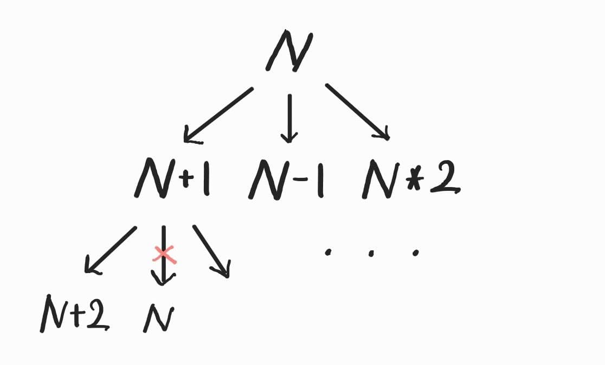

# 13913. 숨바꼭질 4

| 시간 제한 | 메모리 제한 | 제출  | 정답 | 맞힌 사람 | 정답 비율 |
| :-------- | :---------- | :---- | :--- | :-------- | :-------- |
| 2 초      | 512 MB      | 20890 | 7266 | 5069      | 32.512%   |

## 문제

수빈이는 동생과 숨바꼭질을 하고 있다. 수빈이는 현재 점 N(0 ≤ N ≤ 100,000)에 있고, 동생은 점 K(0 ≤ K ≤ 100,000)에 있다. 수빈이는 걷거나 순간이동을 할 수 있다. 만약, 수빈이의 위치가 X일 때 걷는다면 <strong>1초 후에 X-1 또는 X+1로 이동</strong>하게 된다. 순간이동을 하는 경우에는 <strong>1초 후에 2*X의 위치로 이동</strong>하게 된다.

수빈이와 동생의 위치가 주어졌을 때, 수빈이가 동생을 찾을 수 있는 가장 빠른 시간이 몇 초 후인지 구하는 프로그램을 작성하시오.

<br>

#### 입력

첫 번째 줄에 수빈이가 있는 위치 N과 동생이 있는 위치 K가 주어진다. N과 K는 정수이다.

#### 출력

첫째 줄에 수빈이가 동생을 찾는 가장 빠른 시간을 출력한다.

둘째 줄에 어떻게 이동해야 하는지 공백으로 구분해 출력한다.

<br>

## 풀이

#### 아이디어

수빈이가 위치 N에 있을 때, 1초 후에 수빈이는 N+1, N-1, 2*N 로 이동 가능하다.



위와 같은 양상을 띠므로, 쉽게 BFS 탐색을 떠올릴 수 있다.

<br>

해당 문제에서의 핵심은 BFS 탐색 경로를 출력하는 것이다.

이는 visited 배열을 선언함으로써 해결이 가능하다.

```java
visited[to] = from;
```

이처럼 visited 배열을 통해, `방문 여부`를 체크함과 동시에 `방문 경로`를 기록할 수 있다.

<br>

#### 시행 착오

첫 풀이에서는 시작 위치는 -1로, 방문하지 않은 위치들은 0으로 나타냈다.

하지만 해당 풀이는 무한 루프가 돌 수가 있다.

예를 들어, N=0, K=5라 하면, 경로는 0 1 2 4 5 여야 한다.

큐에 push하는 조건을 visited[cur] > 0으로 두었었는데, 해당 방식은 visited[1] = 2이 되어, 무한 루프에 빠지게 된다.

따라서 시작 위치는 같은 N으로 두고, 방문하지 않은 위치들은 -1로 표현하여 해결하였다.

<br>

추가로, visited 배열의 크기를 100001이 아닌 200001으로 두어야 한다.

예를 들어, N=50001, K=100000 이라 하면, 경로는 50001 100002 100001 100000 이 되어야 한다.

50001에서 1씩 추가해서 가는 것보다, 한 번 2배를 하고, -1씩 가는 것이 더 빠르므로, visited 배열의 크기를 최대값 * 2 + 1로 잡아야 한다.


<br>

<details>
<summary>Java 코드 보기</summary>
<div markdown="1">


```java
import java.io.BufferedReader;
import java.io.IOException;
import java.io.InputStreamReader;
import java.util.ArrayList;
import java.util.Arrays;
import java.util.Collections;
import java.util.LinkedList;
import java.util.Queue;
import java.util.Stack;
import java.util.StringTokenizer;

public class Main {
	static final int MAX = 100000;
	static int visited[] = new int[2*MAX+1]; // visited[to] = from을 표시
	
	public static void main(String[] args) throws IOException {
		BufferedReader br = new BufferedReader(new InputStreamReader(System.in));
		String[] input = br.readLine().split(" ");
		
		int N = Integer.parseInt(input[0]);
		int K = Integer.parseInt(input[1]);
		
		Arrays.fill(visited, -1);
		Queue<int[]> q = new LinkedList<>();
		q.add(new int[] {N, 0});
		
		visited[N] = N; // 시작 지점 자기 자신으로 표시
		while(!q.isEmpty()) {
			int cur = q.peek()[0];
			int time = q.peek()[1];
			q.poll();
			
			if(cur == K) {
				Stack<Integer> s = new Stack<>();
				while(cur != N) {
					s.add(cur); // 현재 위치 넣기
					cur = visited[cur]; // 탐색 순서 거꾸로 찾아가기 (to -> from)
				}
				s.add(cur);
				
				StringBuilder sb = new StringBuilder("");
				sb.append(time);
				sb.append("\n");
				while(!s.empty()) {
					sb.append(s.pop());
					sb.append(" ");
				}
				System.out.println(sb.toString());
				return;
			}
			
			// 방문한 곳이 아니라면, 방문
			if(cur+1 < 2 * MAX + 1 && visited[cur+1] < 0) {
				visited[cur+1] = cur;
				q.add(new int[] {cur+1, time+1});
			}
			if(cur-1 >= 0 && visited[cur-1] < 0) {
				visited[cur-1] = cur;
				q.add(new int[] {cur-1, time+1});				
			}
			if(cur*2 < 2 * MAX + 1 && visited[cur*2] < 0) {
				visited[cur*2] = cur;
				q.add(new int[] {cur*2, time+1});				
			}
		}
	}
}
```


</div>
</details>