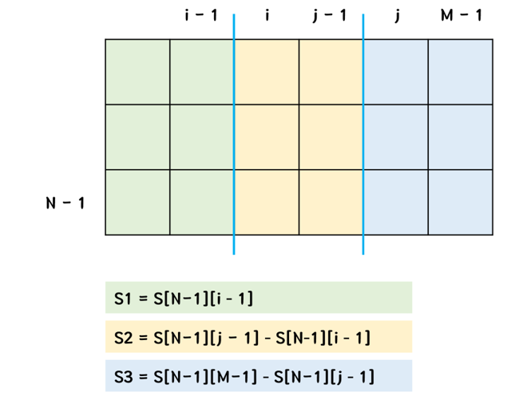
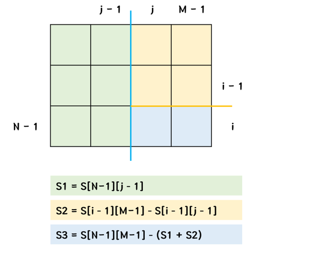

# 1451. 직사각형으로 나누기

| 시간 제한 | 메모리 제한 | 제출 | 정답 | 맞힌 사람 | 정답 비율 |
| :-------- | :---------- | :--- | :--- | :-------- | :-------- |
| 2 초      | 128 MB      | 3652 | 1456 | 1108      | 40.571%   |

## 문제

세준이는 N*M크기로 직사각형에 수를 N*M개 써놓았다.

세준이는 이 직사각형을 겹치지 않는 3개의 작은 직사각형으로 나누려고 한다. 각각의 칸은 단 하나의 작은 직사각형에 포함되어야 하고, 각각의 작은 직사각형은 적어도 하나의 숫자를 포함해야 한다.

어떤 작은 직사각형의 합은 그 속에 있는 수의 합이다. 입력으로 주어진 직사각형을 3개의 작은 직사각형으로 나누었을 때, 각각의 작은 직사각형의 합의 곱을 최대로 하는 프로그램을 작성하시오.

#### 입력

첫째 줄에 직사각형의 세로 크기 N과 가로 크기 M이 주어진다. 둘째 줄부터 직사각형에 들어가는 수가 가장 윗 줄부터 한 줄에 하나씩 M개의 수가 주어진다. N과 M은 50보다 작거나 같은 자연수이고, 직사각형엔 적어도 3개의 수가 있다. 또, 직사각형에 들어가는 수는 한 자리의 숫자이다.

#### 출력

세 개의 작은 직사각형의 합의 곱의 최댓값을 출력한다.

<br/>

## 풀이

잘 풀어 놓고서는... 자료형 때문에 30분 날렸던 문제... long long 자료형 잊지 말자!!

<br/>

해당 문제는 누적 합에 대한 개념과 경우의 수만 잘 나누면 되는 문제이다.

먼저 3개의 작은 직사각형으로 나누는 방법은 다음과 같이 6가지이다.

- ||, =, ㅓ, ㅏ, ㅗ, ㅜ

각각의 경우에 대해서, 직사각형의 합의 곱을 구하면 되는 문제이다.

이 때, 직사각형의 합을 누적 합을 이용해서 구하면 된다.

<br/>

누적 합을 나타내는 배열을 S라 하자.

`S[i][j]` 는 `0 <= y <= i` , `0 <= x <= j` 인 `R[y][x]` 의 합을 나타낸다.

즉 `S[i][j] = S[i-1][j] + S[i][j-1] + R[i][j]` 를 나타낸다.

이러한 누적 합을 이용하면, 다음과 같이 직사각형의 합을 구할 수 있다.

 

<br/>

이를 코드로 나타내면 다음과 같다.

```c++
#include <stdio.h>

typedef long long ll;
int R[55][55];
ll S[55][55];

int main() {
	int N, M;
	ll maxx = 0;
	char c;
	scanf("%d %d", &N, &M);

	for (int i = 0; i < N; i++) {
		getchar();
		for (int j = 0; j < M; j++) {
			scanf("%c", &c);
			R[i][j] = c - '0';
		}
	}
	S[0][0] = R[0][0];
	for (int i = 1; i < N; i++) {
		S[i][0] = S[i - 1][0] + R[i][0];
	}
	for (int i = 1; i < M; i++) {
		S[0][i] = S[0][i - 1] + R[0][i];
	}
	for (int i = 1; i < N; i++) {
		for (int j = 1; j < M; j++) {
			S[i][j] = S[i - 1][j] + S[i][j - 1] - S[i - 1][j - 1] + R[i][j];
		}
	}

	// 가로줄 2개 선택
	for (int i = 1; i < N; i++) {
		for (int j = i + 1; j < N; j++) {
			ll sum = S[i - 1][M - 1] * (S[j - 1][M - 1] - S[i - 1][M - 1]) * (S[N - 1][M - 1] - S[j - 1][M - 1]);
			if (sum > maxx) maxx = sum;
		}
	}

	// 세로줄 2개 선택
	for (int i = 1; i < M; i++) {
		for (int j = i + 1; j < M; j++) {
			ll sum = S[N - 1][i - 1] * (S[N - 1][j - 1] - S[N - 1][i - 1]) * (S[N - 1][M - 1] - S[N - 1][j - 1]);
			if (sum > maxx) maxx = sum;
		}
	}

	for (int i = 1; i < N; i++) {
		for (int j = 1; j < M; j++) {
			// ㅓ
			ll sum = S[i - 1][j - 1] * (S[N - 1][j - 1] - S[i - 1][j - 1]) * (S[N - 1][M - 1] - S[N - 1][j - 1]);
			if (sum > maxx) maxx = sum;
			// ㅏ
			sum = S[i - 1][M - 1] - S[i - 1][j - 1];
			sum *= (S[N - 1][M - 1] - S[N - 1][j - 1] - sum);
			sum *= S[N - 1][j - 1];
			if (sum > maxx) maxx = sum;
			// ㅜ
			sum = S[N - 1][j - 1] - S[i - 1][j - 1];
			sum *= (S[N - 1][M - 1] - S[i - 1][M - 1] - sum);
			sum *= S[i - 1][M - 1];
			if (sum > maxx) maxx = sum;
			// ㅗ
			sum = S[i - 1][j - 1] * (S[i - 1][M - 1] - S[i - 1][j - 1]) * (S[N - 1][M - 1] - S[i - 1][M - 1]);
			if (sum > maxx) maxx = sum;
		}
	}

	printf("%lld", maxx);
	return 0;
}
```
