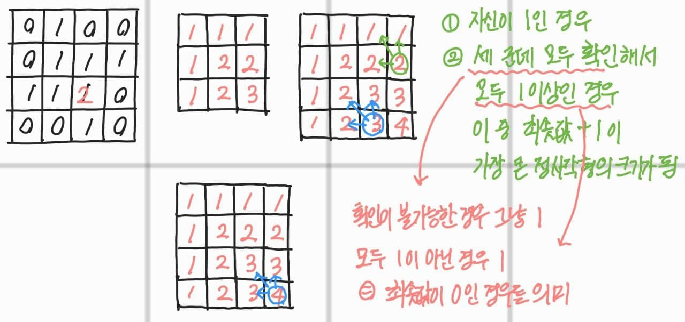

# 1915. 가장 큰 정사각형

| 시간 제한 | 메모리 제한 | 제출  | 정답 | 맞힌 사람 | 정답 비율 |
| :-------- | :---------- | :---- | :--- | :-------- | :-------- |
| 2 초      | 128 MB      | 28989 | 8738 | 6237      | 29.316%   |

## 문제

n×m의 0, 1로 된 배열이 있다. 이 배열에서 1로 된 가장 큰 정사각형의 크기를 구하는 프로그램을 작성하시오.

| 0   | 1   | 0   | 0   |
| --- | --- | --- | --- |
| 0   | 1   | 1   | 1   |
| 1   | 1   | 1   | 0   |
| 0   | 0   | 1   | 0   |

위와 같은 예제에서는 가운데의 2×2 배열이 가장 큰 정사각형이다.

#### 입력

첫째 줄에 n, m(1 ≤ n, m ≤ 1,000)이 주어진다. 다음 n개의 줄에는 m개의 숫자로 배열이 주어진다.

#### 출력

첫째 줄에 가장 큰 정사각형의 넓이를 출력한다.

<br>

## 풀이



<br>

<details>
<summary>C++ 소스 코드 보기</summary>
<div markdown="1">

```c++
#include <iostream>
using namespace std;
int d[1111][1111];

int min(int a, int b) {
	return a < b ? a : b;
}

int main() {
	char c;
	int n, m, max = 0;
	scanf("%d %d", &n, &m);
	getchar();

	for (int i = 0; i < n; i++) {
		for (int j = 0; j < m; j++) {
			scanf("%c", &c);
			d[i][j] = c - '0';
		}
		getchar();
	}

	for (int i = 0; i < n; i++) {
		for(int j = 0; j < m; j++) {
			if (d[i][j] == 1) {
				if (i >= 1 && j >= 1) {
					int a = min(d[i - 1][j - 1], min(d[i - 1][j], d[i][j - 1]));
					if (a > 0) {
						d[i][j] = a + 1;
					}
				}
				max = d[i][j] > max ? d[i][j] : max;
			}
		}
	}

	printf("%d", max * max);
	return 0;
}
```

</div>
</details>
