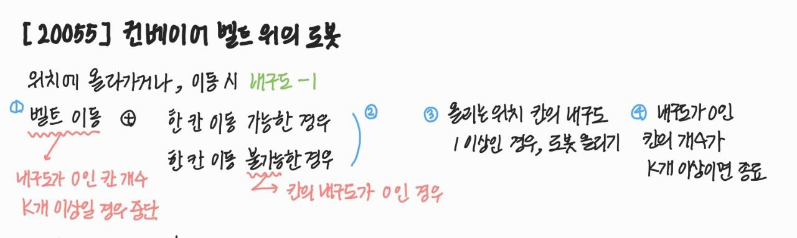
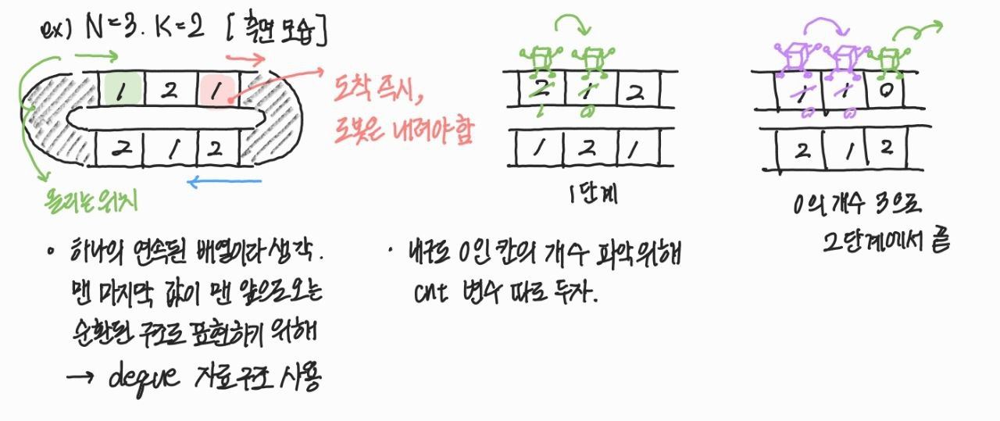

# 20055. 컨베이어 벨트 위의 로봇

| 시간 제한 | 메모리 제한 | 제출 | 정답 | 맞힌 사람 | 정답 비율 |
| :-------- | :---------- | :--- | :--- | :-------- | :-------- |
| 1 초      | 512 MB      | 7581 | 4290 | 2895      | 55.375%   |

## 문제

길이가 N인 컨베이어 벨트가 있고, 길이가 2N인 벨트가 이 컨베이어 벨트를 위아래로 감싸며 돌고 있다. 벨트는 길이 1 간격으로 2N개의 칸으로 나뉘어져 있으며, 각 칸에는 아래 그림과 같이 1부터 2N까지의 번호가 매겨져 있다.


벨트가 한 칸 회전하면 1번부터 2N-1번까지의 칸은 다음 번호의 칸이 있는 위치로 이동하고, 2N번 칸은 1번 칸의 위치로 이동한다. i번 칸의 내구도는 Ai이다. 위의 그림에서 1번 칸이 있는 위치를 "**올리는 위치**", N번 칸이 있는 위치를 "**내리는 위치**"라고 한다.

컨베이어 벨트에 박스 모양 로봇을 하나씩 올리려고 한다. 로봇은 올리는 위치에만 올릴 수 있다. 언제든지 로봇이 내리는 위치에 도달하면 그 즉시 내린다. 로봇은 컨베이어 벨트 위에서 스스로 이동할 수 있다. 로봇을 올리는 위치에 올리거나 로봇이 어떤 칸으로 이동하면 그 칸의 내구도는 즉시 1만큼 감소한다.

컨베이어 벨트를 이용해 로봇들을 건너편으로 옮기려고 한다. 로봇을 옮기는 과정에서는 아래와 같은 일이 순서대로 일어난다.

1. 벨트가 각 칸 위에 있는 로봇과 함께 한 칸 회전한다.
2. 가장 먼저 벨트에 올라간 로봇부터, 벨트가 회전하는 방향으로 한 칸 이동할 수 있다면 이동한다. 만약 이동할 수 없다면 가만히 있는다.
   1. 로봇이 이동하기 위해서는 이동하려는 칸에 로봇이 없으며, 그 칸의 내구도가 1 이상 남아 있어야 한다.
3. 올리는 위치에 있는 칸의 내구도가 0이 아니면 올리는 위치에 로봇을 올린다.
4. 내구도가 0인 칸의 개수가 K개 이상이라면 과정을 종료한다. 그렇지 않다면 1번으로 돌아간다.

종료되었을 때 몇 번째 단계가 진행 중이었는지 구해보자. 가장 처음 수행되는 단계는 1번째 단계이다.

#### 입력

첫째 줄에 N, K가 주어진다. 둘째 줄에는 A1, A2, ..., A2N이 주어진다.

#### 출력

몇 번째 단계가 진행 중일때 종료되었는지 출력한다.

#### 제한

- 2 ≤ N ≤ 100
- 1 ≤ K ≤ 2N
- 1 ≤ Ai ≤ 1,000

<br>

## 풀이



<br>



길이가 N인 컨베이어 벨트를,

그림과 같이 길이가 2\*N인 컨베이어 벨트가 위아래로 감싸고 있는 상황

즉 문제의 그림은 측면 모습을 나타낸 것이며,

위의 맨 처음 위치에 로봇이 올라가고, 위의 맨 마지막 위치에서 로봇이 내려야 함

단, 내구도가 0인 칸 위로 로봇이 올라가지 못하며,

이러한 내구도는 로봇이 한 번 올라갈 때마다 1씩 감소한다.

<br>

해당 문제에서 벨트가 순환적으로 돌기 때문에 deque 자료 구조를 사용하여

1, 2, 3, 4 단계별로 차례대로 구현하면 됨

```c++

#include <iostream>
#include <vector>
#include <deque>
using namespace std;

struct Room {
	int idx, d, r; // index, 내구도, robot 존재 여부
	int ck = 0; // check

	Room(int _i, int _d, int _r) : idx(_i), d(_d), r(_r) {};
};

int main() {
	int N, K;
	scanf("%d %d", &N, &K);

	int c, cnt = 0, res = 0;

	deque<Room> cb, r; // index, 내구도, robot 존재 여부
	for (int i = 0; i < 2 * N; i++) {
		scanf("%d", &c);
		cb.push_back(Room(i, c, 0));
	}

	while (1) {
		res++;

		// 1. 벨트가 각 칸 위에 있는 로봇과 함께 한 칸 회전
		cb.push_front(cb.back());
		cb.pop_back();
		cb[N - 1].r = 0;

		// 2. 로봇 한 칸 이동 가능 시, 이동 (내구도 1 이상, 로봇이 없는 경우 이동 가능)
		//	  로봇 이동 시, 이동한 칸의 내구도 - 1
		for (int i = N - 2; i >= 0; i--) {
			if (cb[i].r && cb[i + 1].d && !cb[i + 1].r) {
				cb[i].r = 0;
				cb[i + 1].r = 1;
				cb[i + 1].d--;
				if (cb[i + 1].d == 0 && !cb[i + 1].ck) {
					cb[i + 1].ck = 1;
					cnt++;
				}
				if (i == N - 2) {
					cb[i + 1].r = 0;
				}
			}
		}

		// 3. 올리는 위치에 있는 칸의 내구도가 0이 아니면, 올리는 위치에 로봇을 올림
		//    올릴 수 있다면, 첫 칸의 내구도 - 1
		if (cb[0].d) {
			cb[0].d--;
			cb[0].r = 1;
			if (cb[0].d == 0) {
				cb[0].ck = 1;
				cnt++;
			}
		}

		if (cnt >= K) break;
	}

	printf("%d", res);
	return 0;
}

```
