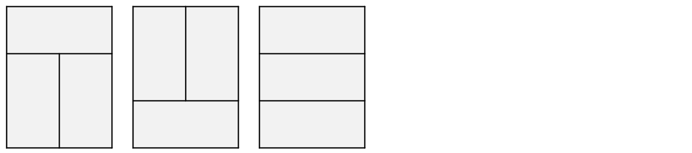
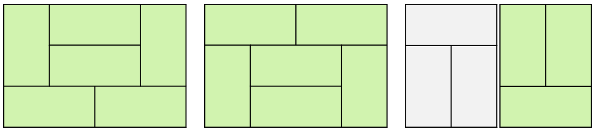
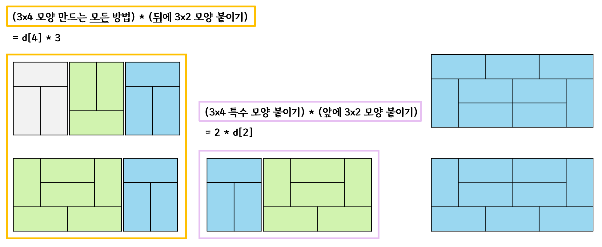

# 2133. 타일 채우기

| 시간 제한 | 메모리 제한 | 제출  | 정답  | 맞힌 사람 | 정답 비율 |
| :-------- | :---------- | :---- | :---- | :-------- | :-------- |
| 2 초      | 128 MB      | 42983 | 15372 | 12153     | 35.596%   |

## 문제

3×N 크기의 벽을 2×1, 1×2 크기의 타일로 채우는 경우의 수를 구해보자.

#### 입력

첫째 줄에 N(1 ≤ N ≤ 30)이 주어진다.

#### 출력

첫째 줄에 경우의 수를 출력한다.

#### 힌트

아래 그림은 3×12 벽을 타일로 채운 예시이다.


<br/>

## 풀이

점화식 구하는 데 애썼던 문제

점화식만 도출해낼 수 있으면, 코드는 간단하다.

<br/>

먼저 점화식 부터 정의하자면,

d[N]은 3xN 크기의 벽을 2x1, 1x2 크기의 타일로 채우는 경우의 수로, 다음과 같다.

```latex
d[N] = 3 * d[N - 2] + 2 * d[N - 4] + ... + 2 * d[0]
```

가장 먼저, N이 홀수일 때는 2x1, 1x2 크기의 타일로 채울 수 없으므로 0 이다.

N이 2일 때, 4일 때, 6일 때를 그려보고, 이들 간의 관계를 구해보자.

<br/>

#### `N=2`



다음과 같은 모양 3가지가 나온다.

<br/>

#### `N=4`

3x4는 3x4 모양 1가지로 만들 수 있고, 3x2 모양 2개를 붙여 만들 수 있다.



독특한 왼쪽 2가지와, N=2를 조합한 3x3가지가 나온다. 총 11가지이다.

이는 d[4] = 3 _ d[4 - 2] + 2 _ d[4 - 4] 으로 나타낼 수 있다.

- d[4 - 2]는 3x2 모양을 만드는 경우의 수로, 3x2 모양 3가지를 붙여 3x4를 만든다는 뜻

- d[4 - 4]는 3x0 모양을 만드는 경우의 수로 1가지로 나타냈다.

  이에 3x4 모양을 만드는 경우의 수 2가지가 있으므로, 2를 곱했다.

<br/>

#### `N=6`

3x6을 만드는 방법에는 크게 3가지이다.

- 3x2 3개를 붙여 만드는 방법
- 3x2 1개와 3x4를 붙여 만드는 방법
- 3x6 특수 모양 하나

d[6]과 d[4]와의 관계를 찾기 위해 d[4]를 이용하여, 3x6 모양을 만들어보자.

<br/>


- 좌측에 3x4 2가지 모양에 앞/뒤로 3x2 모양을 붙이거나 ... ⓐ
- 우측에 3x2 + 3x2 모양에 3x2 모양을 붙이는 방법이 있다. ... ⓑ

위 두 가지를 `d[2] * d[4]` 로 표현하게 되면, ⓐ번의 반만 구하게 되는 셈이고,

`2 * d[2] * d[4]` 로 표현하게 되면, ⓑ번을 2번 구하게 되는 셈이다.

<br/>

3x6 모양을 만드는 방법을 그려보고, 다시 정리해보자.



- 좌측의 주황색 부분은 위의 ⓐ/2 + ⓑ 를 나타낸 것이다.
- 중앙의 보라색 부분은 ⓐ/2이다.

따라서 d[6] = 3 _ d[6 - 2] + 2 _ d[6 - 4] + 2 \* d[6 - 6] 으로 나타낼 수 있다.

- 3 \* d[6-2]는 3x4 모양을 만들 수 있는 경우의 수에, 3x2 모양 3가지를 붙여 3x6을 만드는 방법
- 2 \* d[6-4]는 3x2 모양을 만들 수 있는 경우의 수에, 3x4 특수 모양 2가지를 붙이는 방법
- 2 \* d[6-6]는 3x0 모양을 만들 수 있는 경우의 수에, 3x6 특수 모양 2가지를 붙이는 방법

<br/>

이를 코드로 나타내면 다음과 같다.

```c++
#include <stdio.h>

int d[31] = { 1, 0, 3 };

int f(int n) {
	if (n % 2) return 0;
	if (d[n]) return d[n];

	int res = f(n - 2) * 3;
	for (int i = 4; i <= n; i += 2) {
		res += 2 * f(n - i);
	}
	return res;
}

int main() {
	int N;
	scanf("%d", &N);
	printf("%d", f(N));
	return 0;
}
```
