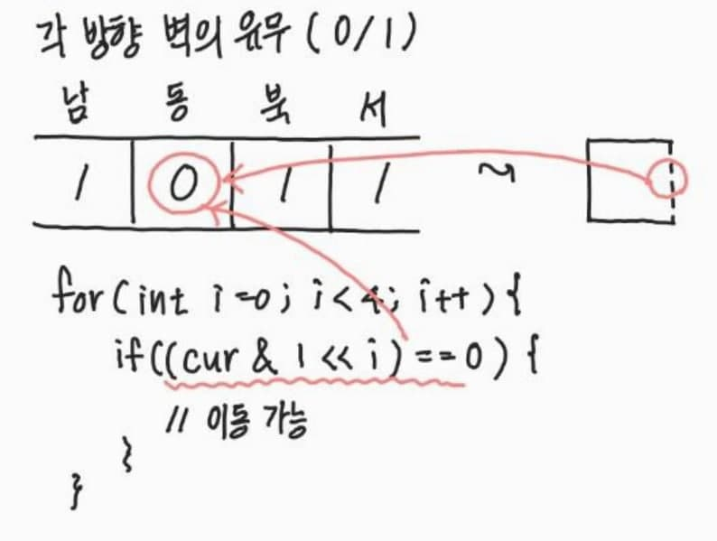

# 2234. 성곽

| 시간 제한 | 메모리 제한 | 제출 | 정답 | 맞힌 사람 | 정답 비율 |
| :-------- | :---------- | :--- | :--- | :-------- | :-------- |
| 2 초      | 128 MB      | 7177 | 3283 | 2333      | 44.531%   |

## 문제


대략 위의 그림과 같이 생긴 성곽이 있다. 굵은 선은 벽을 나타내고, 점선은 벽이 없어서 지나다닐 수 있는 통로를 나타낸다. 이러한 형태의 성의 지도를 입력받아서 다음을 계산하는 프로그램을 작성하시오.

1. 이 성에 있는 방의 개수
2. 가장 넓은 방의 넓이
3. 하나의 벽을 제거하여 얻을 수 있는 가장 넓은 방의 크기

위의 예에서는 방은 5개고, 가장 큰 방은 9개의 칸으로 이루어져 있으며, 위의 그림에서 화살표가 가리키는 벽을 제거하면 16인 크기의 방을 얻을 수 있다.

성은 M × N(1 ≤ M, N ≤ 50)개의 정사각형 칸으로 이루어진다. 성에는 최소 두 개의 방이 있어서, 항상 하나의 벽을 제거하여 두 방을 합치는 경우가 있다.

<br>

#### 입력

첫째 줄에 두 정수 N, M이 주어진다. 다음 M개의 줄에는 N개의 정수로 벽에 대한 정보가 주어진다. **벽에 대한 정보**는 한 정수로 주어지는데, 서쪽에 벽이 있을 때는 1을, 북쪽에 벽이 있을 때는 2를, 동쪽에 벽이 있을 때는 4를, 남쪽에 벽이 있을 때는 8을 더한 값이 주어진다. 참고로 **이진수의 각 비트**를 생각하면 쉽다. 따라서 이 값은 0부터 15까지의 범위 안에 있다.

#### 출력

첫째 줄에 1의 답을, 둘째 줄에 2의 답을, 셋째 줄에 3의 답을 출력한다.

<br>


## 풀이

<br>

**방의 개수, 가장 넓은 방의 크기 구하기**

 

- 2중 for문으로 방(room)을 탐색하면서, 방문(visited)하지 않은 곳 방문

	BFS 탐색으로 해당 방을 탐색하면서, 방의 크기(size)를 파악 가능

	`cur & 1 << i` 의 결과가 0인 경우 벽이 뚫려있다는 뜻이고,

	결과가 0보다 큰 경우, 벽으로 막혀있다는 의미이다.	

- BFS 탐색이 끝나면, 탐색한 방의 크기를 return함으로써

	방의 크기를 size 배열에 저장: `size[room_idx] = room_size`

	가장 넓은 방의 크기(max) 파악 가능

<br>

**하나의 벽 제거하여, 얻을 수 있는 가장 넓은 방의 크기 구하기**

- 인접한 방인가를 어떻게 판단하는가?

	visited 배열에 방의 개수(cnt) 저장 => 이는 방 번호를 나타냄

	2중 for문으로 방을 탐색하는데,
	
	이는 좌->우/상->하 순서로 탐색하는 것으로 강제했다는 것으로,
	
	남쪽/동쪽 방향에 벽이 있는지만 확인하면 됨

	확인했을 때, 방 번호가 다르다면 벽을 뚫는 방식으로 진행함

- 벽을 제거 후, 방 크기는 어떻게 구하는가?

	앞서 저장한 size 배열에 의해, 방 번호만 알면
	
	방 번호를 index로 하여, 덧셈으로 변경된 방 크기를 쉽게 구할 수 있다.


<br>
<details>
<summary>Java 소스 코드 보기</summary>
<div markdown="1">

```java
package com.study.boj;

import java.io.BufferedReader;
import java.io.IOException;
import java.io.InputStreamReader;
import java.util.LinkedList;
import java.util.Queue;
import java.util.StringTokenizer;

public class BOJ_2234 {
	static final int MAX = 2555; // 최대 방 개수
	static final int dy[] = { 0, -1, 0, 1 }; // 서, 북, 동, 남
	static final int dx[] = { -1, 0, 1, 0 };

	static int N, M;
    // 방 번호, 가장 넓은 방 크기, 벽 제거 후 가장 넓은 방 크기
	static int cnt = 1, max = Integer.MIN_VALUE, res = Integer.MIN_VALUE; 
	
	static int[][] room; // 벽 정보를 저장하는 배열
	static int[][] visited; // 방 번호를 저장하는 배열
	static int[] size; // size[room_num] = room_size;

	public static void main(String[] args) throws IOException {
		BufferedReader br = new BufferedReader(new InputStreamReader(System.in));
		StringTokenizer st = new StringTokenizer(br.readLine(), " ");

		N = Integer.parseInt(st.nextToken()); // 열
		M = Integer.parseInt(st.nextToken()); // 행

		room = new int[M][N];
		visited = new int[M][N];
		size = new int[MAX];

		for (int i = 0; i < M; i++) {
			st = new StringTokenizer(br.readLine(), " ");
			for (int j = 0; j < N; j++) {
				room[i][j] = Integer.parseInt(st.nextToken());
			}
		}

		for (int i = 0; i < M; i++) {
			for (int j = 0; j < N; j++) {
				if (visited[i][j] == 0) { // 방문하지 않았다면, 방문
					size[cnt] = bfs(i, j);
					max = Math.max(size[cnt++], max);
				}
			}
		}

		for (int i = 0; i < M; i++) {
			for (int j = 0; j < N; j++) {
				for (int k = 2; k < 4; k++) {
					int ny = i + dy[k], nx = j + dx[k];
					if(ny < 0 || ny >= M || nx < 0 || nx >= N) continue;
					if ((room[i][j] & 1 << k) > 0 && visited[i][j] != visited[ny][nx]) {
						// 벽 뚫어서, 방 합친 크기 구하기
						int newSize = size[visited[i][j]] + size[visited[ny][nx]];
						res = newSize > res ? newSize : res;
					}
				}
			}
		}

		System.out.println((cnt-1) + "\n" + max + "\n" + res);
	}

	private static int bfs(int y, int x) {
		Queue<int[]> pos = new LinkedList<>();
		pos.add(new int[] { y, x });
		int area = 1; // 방 사이즈
		visited[y][x] = cnt;

		while (!pos.isEmpty()) {
			int cy = pos.peek()[0];
			int cx = pos.poll()[1];

			for (int i = 0; i < 4; i++) {
				int ny = cy + dy[i], nx = cx + dx[i];
				if(ny < 0 || ny >= M || nx < 0 || nx >= N) continue;
				if ((room[cy][cx] & 1 << i) == 0 && visited[ny][nx] == 0) { // 벽이 없고, 방문하지 않은 경우
					area++;
					visited[ny][nx] = cnt;
					pos.add(new int[] { ny, nx });
				}
			}
		}
		
		return area;
	}
}
```

</div>
</details>