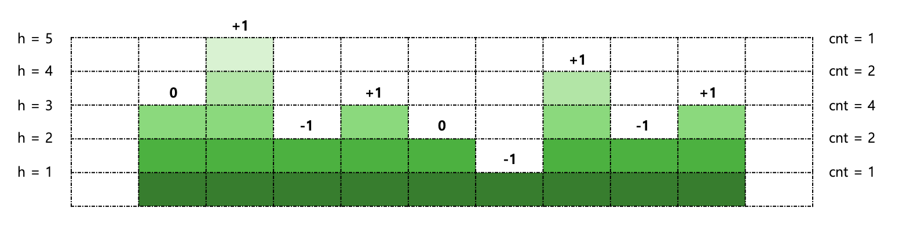

## 문제

간단하게 생각해보면 다음과 같은 풀이가 나온다.

1. 해수면의 높이(H[i])를 설정하고,
2. 빙산들(N)을 탐색하면서, 연속으로 height보다 큰지 판단하며, 빙산 덩어리 개수 카운트하기

하지만 위 풀이는 O(N^2)으로 N이 최대 100,000이라 시간 초과가 발생한다.

위 풀이를 다음과 같이 줄일 수 있다.


<br/>

1. 해수면의 높이를 내림차순으로 정렬하여, 높이가 높은 순서대로 설정해 나간다. (이 때 설정한 높이를 height라 하자.)
2. 빙산들을 모두 탐색하지 않고, height에 걸쳐 있는 빙산(idx)을 기준으로 좌(idx-1),우(idx+1)가 현재 해수면의 높이(height) 위에 있는지, 아래에 있는지를 살펴야 한다.
   1. 좌, 우 모두 height 아래에 있다면, 빙산 개수를 1 증가시킨다.
   2. 좌, 우 둘 중 하나가 height 위에 있다면, 빙산 개수는 그대로다.
   3. 좌, 우 모두 height 위에 있다면, 빙산 개수를 1 감소시킨다.
3. 현재 빙산 개수가 최댓값인지 판단한다.

해당 풀이는 height 개수만큼으로, O(N)의 시간복잡도가 나온다.

<br/>

## 풀이

이를 코드로 구현하면 총 3가지 변수가 필요하다.

1. height를 중복되지 않게, 내림차순으로 기록할 수 있는 `Set`
2. 좌, 우가 height 아래에 있는지, 위에 있는지는 현재 height에서 좌, 우의 방문 여부로 판단가능하므로 `visited 배열`로 나타낼 수 있다.
3. height별 걸쳐 있는 인덱스들을 기록하기 위한 `Map<Integer, List<Integer>>`

<br/>

```java
import java.io.*;
import java.util.*;

public class Main {
    private static int N;
    private static int[] H;
    private static boolean[] visited;
    private static Set<Integer> heights; // 가능한 해수면 높이 (내림차순)
    private static Map<Integer, List<Integer>> heightToIdxs; // 높이 별 인덱스들

    public static void init() throws IOException {
        BufferedReader br = new BufferedReader(new InputStreamReader(System.in));
        N = Integer.parseInt(br.readLine());
        H = new int[N + 2];
        visited = new boolean[N + 2];
        heights = new TreeSet<>((o1, o2) -> o2 - o1);
        heightToIdxs = new HashMap<>();

        for (int i = 1; i <= N; i++) {
            H[i] = Integer.parseInt(br.readLine());
            heights.add(H[i]);
            heightToIdxs.putIfAbsent(H[i], new ArrayList<>());
            heightToIdxs.get(H[i]).add(i);
        }
    }

    public static int solution() {
        int result = 0, cnt = 0;

        for (Integer height : heights) {
            List<Integer> idxs = heightToIdxs.get(height);
            for (Integer idx : idxs) {
                if (visited[idx]) continue;
                visited[idx] = true;
                if (!visited[idx - 1] && !visited[idx + 1]) cnt++;
                else if (visited[idx - 1] && visited[idx + 1]) cnt--;
            }
            result = Math.max(result, cnt);
        }

        return result;
    }

    public static void main(String[] args) throws IOException {
        init();
        
        System.out.println(solution());
    }
}
```