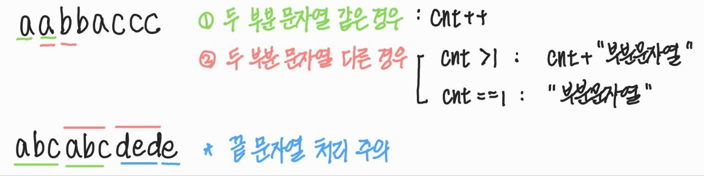

## 문제

[압축 문자열](https://programmers.co.kr/learn/courses/30/lessons/60057)

<br>

## 풀이

모든 경우의 수를 나눠보자.


<br>

1. substring [i, i+n), [i+n, i+2\*n) 비교 (단, i의 범위 조심)

   - 두 substring이 같다면, cnt++
   - 두 substring이 다르다면,
     - cnt > 1인 경우, to_string(cnt) + substring 더하기
     - cnt == 1인 경우, substring 더하기

2. 끝값 주의하기

   - cnt > 1 인 경우, 즉 마지막으로 비교한 부분 문자열 값이 같은 경우

     to_string(cnt) + substring 더하기

   - cnt == 1인 경우

     - s.length() % n == 0 인 경우
       - 마지막 두 개의 부분 문자열이 다른 문자열 경우
     - s.length() % n > 0 인 경우
       - 마지막 두 개의 부분 문자열의 길이가 다르므로, 무조건 다른 문자열

     substring 더하기

<br>

위의 경우들을 축약해서 설명하면,

반복문을 돌면서, 두 개의 부분 문자열을 비교하여 최종 결과값 comp 문자열을 만드는데,

같으면 cnt값만 1 더해주고, 다르면 비교한 부분 문자열 중 앞의 것을 comp에 추가한다.

문자열 비교가 끝난 이후, comp에 들어가지 않은 끝 값을 추가해주어야 하는데,

이 끝 값들은 크게 3가지 경우가 있다.

마지막 두 개의 부분 문자열의 길이가 달라, 비교조차하지 못한 문자열,

그리고 두 개의 부분 문자열의 길이가 같지만, 다른 문자열,

마지막으로 두 개의 부분 문자열의 길이가 같고, 같은 문자열인 경우

해당 값들을 comp 문자열에 잘 처리하여 넣어주면 원하는 압축 문자열 comp가 나온다.

<br>

이를 코드로 표현하면 다음과 같이 줄여, 구현할 수 있다.

```c++
#include <iostream>
#include <string>
#include <vector>
using namespace std;

int solution(string s) {
	int n = 0, min = s.length(); // 자르는 단위 개수

	// 1개, 2개, ..., s.length/2개까지 자를 수 있음
	while (++n <= (s.length() / 2)) {
		int i, cnt = 1;
		string comp = "";
		for (i = 0; i <= s.length() - 2 * n; i += n) {
			if (!s.substr(i, n).compare(s.substr(i + n, n))) {
				cnt++;
				continue;
			}
			if (cnt > 1) {
				comp += to_string(cnt);
				cnt = 1;
			}
			comp += s.substr(i, n);
		}

		if (cnt > 1) {
			comp += to_string(cnt);
		}
		comp += s.substr(i);
		min = comp.length() < min ? comp.length() : min;
	}

	return min;
}

int main() {
	string s = "aabbaccc";
	cout << solution(s);

	return 0;
}
```
